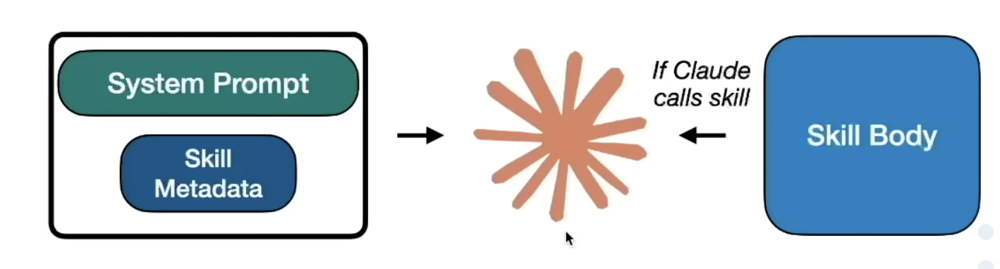

# Claude Skills

Reusable, filesystem-based instructions that give Claude domain-specific expertise — without repeating yourself.

---

## The Problem with MCP Servers

MCP (Model Context Protocol) servers are powerful, but they come with friction:

- **Setup overhead** — requires running a separate server process
- **Reliability issues** — network/connection failures break the workflow
- **Overkill for static knowledge** — if you just need Claude to *know how to do something*, a live server is unnecessary

**Skills solve this** by keeping instructions local, simple, and always available — no server needed.

---

## MCP vs Skills

| Feature | MCP Servers | Skills |
| :--- | :--- | :--- |
| **Best for** | Live data, APIs, dynamic tools | Reusable instructions & expertise |
| **Sharable** | Complex to distribute | Copy a folder |
|**What is does**|Gives Context + code to agents| Gives tools + context to LLMs|
|**How it works**|Progressive disclousure. Context and code loaded as needed|All tools & metatdata loaded at start|
| **Requires** | Running server process | Just files |
| **Failure point** | Network/connection issues | None |
|**Main Use**|Teaches agent how to do thinngs with the available tools|Giving agent access to all tools and integeations|
---

## What is a Skill?

A skill is just **a folder with files in it.**

```bash
skill-name/
├── SKILL.md          ← Core instruction file (name + description + how-to)
├── how-to/
│   ├── step1.md
│   └── step2.md
└── scripts/
    └── helper.py
```
The `SKILL.md` file is the entry point — it contains:
- **Name** (~64 chars)
- **Description** (~1024 chars) — helps Claude decide *when* to use the skill
- **Body** — the actual instructions in Markdown

---

## How It Works: Hierarchical Context Management

Skills utilize a tiered loading system to ensure Claude remains performant without hitting token limits prematurely.

| Level | Content | Enters Context Window... | Tokens |
|---|---|---|---|
| **Level 1** | SKILL.md metadata | On start up | ~100 |
| **Level 2** | SKILL.md body | When Claude invokes the skill | < 5k |
| **Level 3** | Files and folders in skills directory | As needed by Claude | No limit |


**Enables Better Context Management** ✅

1. Skills are listed with a name and description at the start of Claude's context.
2. Claude reads the descriptions and **smartly decides** which skill(s) apply to your request.
3. Claude loads and follows the relevant skill's instructions based on the levels above.

> The clearer the instructions, the better Claude performs.

No need to tell Claude *how* to do something every time — write it once in a skill, and Claude picks it up automatically.

---

## Why Use Skills?

- ✅ **Write instructions once**, reuse forever
- ✅ **Claude auto-selects** the right skill for the task
- ✅ **Works offline**, no servers, no setup
- ✅ **Easy to share** — just copy the folder
- ✅ **Version-control friendly** (plain text/Markdown)

## How to deploy

**Options 1**

zip the files `SKILL.md`, `research_methodology.md`, and directory `scripts/` and upload it to claude code desktop by moving to the connectors as shown below.


**Options 2**

Create a project/skill directory under this folder `mkdir -p ~/.claude/skills/ai-tutor` and move these files `SKILL.md`, `research_methodology.md`, and directory `scripts/` to **ai-tutor** directory