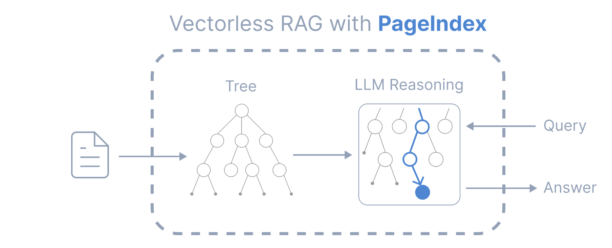

# PageIndex: Vectorless RAG

A reasoning-based approach to Retrieval-Augmented Generation (RAG) that eliminates the need for vector embeddings and chunking.



## 📋 Table of Contents

- [Overview](#overview)
- [The Problem with Traditional RAG](#the-problem-with-traditional-rag)
- [How PageIndex Works](#how-pageindex-works)
- [Key Advantages](#key-advantages)
- [Limitations](#limitations)
- [Conclusion](#conclusion)

## 🎯 Overview

PageIndex is a **vectorless, reasoning-based RAG system** that fundamentally reimagines how we retrieve information from documents. Instead of relying on semantic similarity search through vector embeddings, PageIndex builds a hierarchical table of contents and uses LLM reasoning to navigate documents intelligently.

## ❌ The Problem with Traditional RAG

Traditional RAG systems face several critical limitations:

### 1. **Context Window Constraints**
- Limited context windows restrict the amount of information that can be processed
- Increasing context windows leads to increased hallucinations and reduced accuracy

### 2. **Chunking-Induced Data Loss**
- Breaking documents into chunks often loses critical context
- Cross-references between pages or sections are broken
- If a paragraph references another page, RAG cannot follow that reference for additional context

### 3. **Vague Query Handling**
- High-level or ambiguous queries struggle to find relevant documents
- The system cannot reason about what information might be needed

### 4. **The Retrieval Lottery Problem**
- Retrieval is essentially a "lottery" based on similarity matching
- **Silent failures** occur when semantically similar but contextually irrelevant content is retrieved
- **Similarity ≠ Relevance** — what we truly need is relevance, which requires reasoning, not just pattern matching

## 🔍 How PageIndex Works

PageIndex takes a fundamentally different approach:

```
Traditional RAG:
Document → Chunks → Embeddings → Vector DB → Similarity Search → Answer

PageIndex (Vectorless RAG):
Document → Hierarchical Index → Reasoning-Based Retrieval → Answer
```

### Core Components

#### 🚫 **No Vector Database**
- Eliminates the need for embedding models and vector storage
- No dependency on semantic similarity calculations

#### 🚫 **No Chunking**
- Documents remain intact, preserving full context
- Cross-references and relationships between sections are maintained

#### 🧠 **Human-Like Retrieval**
- Uses LLM reasoning to navigate document structure
- Mimics how humans would search through a table of contents
- Makes intelligent decisions about which sections to explore

#### 📊 **Better Explainability and Traceability**
- Clear reasoning path showing why specific sections were selected
- Easy to understand and debug retrieval decisions
- Transparent navigation through the document hierarchy

### The Process

1. **Build Hierarchical Index**: Create a tree-like table of contents from the document structure
2. **Reasoning-Based Navigation**: LLM analyzes the query and navigates the index intelligently
3. **Context-Aware Retrieval**: Retrieve relevant sections while maintaining full context
4. **Generate Answer**: Produce answers based on truly relevant information

## ✨ Key Advantages

- **No Silent Failures**: Reasoning-based retrieval is transparent and traceable
- **Context Preservation**: No information loss from chunking
- **Cross-Reference Support**: Can follow references across document sections
- **Better for Vague Queries**: Reasoning helps interpret ambiguous questions
- **Explainable Results**: Clear path from query to retrieved content
- **No Embedding Overhead**: Eliminates the cost and complexity of vector operations

## ⚠️ Limitations

While PageIndex offers significant advantages, it's important to understand its constraints:

1. **Document Structure Dependency**
   - Heavily relies on well-structured documents with clear headings
   - Poor or missing headings significantly reduce effectiveness

2. **LLM Reasoning Dependency**
   - Performance depends on the LLM's reasoning capabilities
   - May occasionally choose the wrong navigation path

3. **Speed Considerations**
   - Step-by-step navigation can be slower than direct vector similarity search
   - Multiple reasoning steps add latency

4. **Multi-Document Challenges**
   - Less effective when searching across many unrelated documents
   - Works best with structured, hierarchical content

5. **Unstructured Content**
   - Performance drops significantly with poorly organized or unstructured documents
   - Requires clear document hierarchy to function optimally

## 🎓 Conclusion

### Can PageIndex Replace Traditional RAG?

**Not entirely, but it's a powerful alternative for specific use cases.**

#### When to Use PageIndex:
- ✅ Working with well-structured documents (technical docs, manuals, reports)
- ✅ Need for explainable and traceable retrieval
- ✅ Handling complex queries that require reasoning
- ✅ Documents with important cross-references
- ✅ When context preservation is critical

#### When to Use Traditional RAG:
- ✅ Large-scale, multi-document search across diverse content
- ✅ Speed is the primary concern
- ✅ Working with unstructured or poorly organized content
- ✅ Simple similarity-based retrieval is sufficient

### The Future: Hybrid Approaches

The most promising direction may be **hybrid systems** that combine:
- Vector search for broad, fast retrieval
- Reasoning-based navigation for precise, context-aware selection
- The strengths of both approaches to overcome their individual limitations

PageIndex represents an important evolution in RAG systems, demonstrating that **reasoning can be more valuable than similarity** when relevance truly matters. It's not about replacing traditional RAG entirely, but rather expanding our toolkit with a complementary approach that excels where vector-based methods struggle.

---

## 🚀 Getting Started

Check out the [Vectorless-RAG-with-PageIndex.ipynb](Vectorless-RAG-with-PageIndex.ipynb) notebook to see PageIndex in action.

