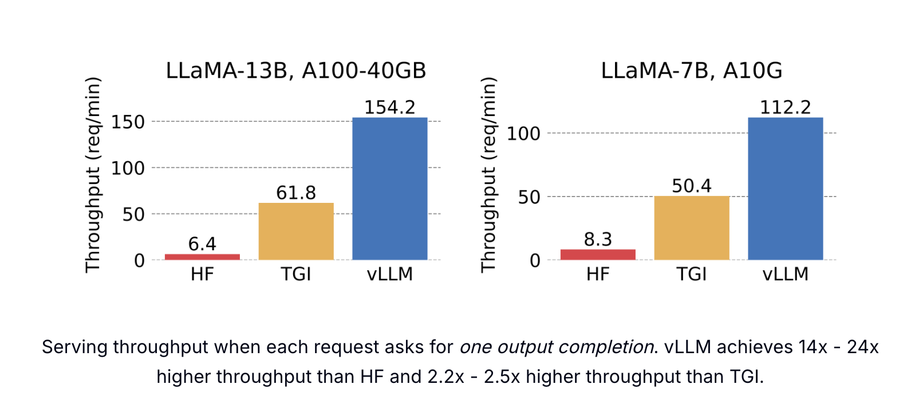
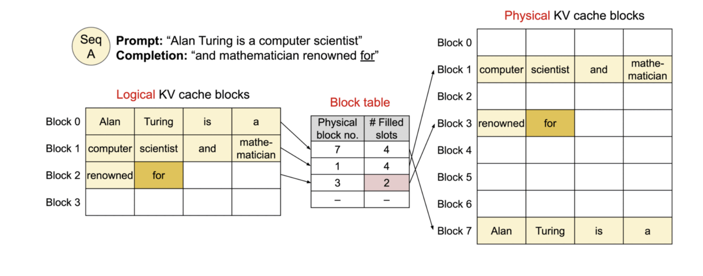

# vLLM: Revolutionizing Large Language Model Inference with PagedAttention


## 📋 Table of Contents

- [Introduction](#introduction)
- [The Challenge: LLM Inference Bottleneck](#the-challenge-llm-inference-bottleneck)
- [What is vLLM?](#what-is-vllm)
- [The Memory Problem: Understanding KV Cache](#the-memory-problem-understanding-kv-cache)
- [PagedAttention: The Game-Changing Solution](#pagedattention-the-game-changing-solution)
- [Installation](#installation)
- [Quick Start Guide](#quick-start-guide)
- [Conclusion](#conclusion)
- [References](#references)

---

## 🚀 Introduction

Large Language Models (LLMs) have transformed the AI landscape, but deploying them efficiently remains a significant challenge. **The primary bottleneck? Expensive hardware requirements and memory constraints.**

Running LLM inference at scale demands:
- High-end GPUs with substantial VRAM
- Efficient memory management
- Optimized serving infrastructure
- Cost-effective solutions for production workloads

This is where **vLLM** comes in—an open-source library that revolutionizes LLM inference and serving through innovative memory management techniques.

---

## 🔥 The Challenge: LLM Inference Bottleneck

### Why is LLM Inference So Expensive?

The performance of LLM serving is fundamentally **bottlenecked by memory**, not compute. Here's why:

1. **Large Model Sizes**: Modern LLMs contain billions of parameters
2. **Dynamic Memory Requirements**: Input sequences vary in length
3. **Memory Fragmentation**: Inefficient allocation leads to wasted resources
4. **GPU Memory Constraints**: Limited VRAM restricts batch sizes and throughput

Traditional serving systems waste **60-80% of GPU memory** due to:
- Memory fragmentation
- Over-reservation of memory blocks
- Inefficient KV cache management

---

## 💡 What is vLLM?

**vLLM** is an open-source library designed for **fast LLM inference and serving**. It introduces a groundbreaking attention algorithm called **PagedAttention** that fundamentally changes how we manage memory during inference.

### Key Highlights:

- ⚡ **24x higher throughput** compared to HuggingFace Transformers
- 🎯 **No model architecture changes required**
- 🔧 **Drop-in replacement** for existing inference pipelines
- 💾 **Near-optimal memory utilization** (<4% waste)
- 🚀 **State-of-the-art serving performance**

### vLLM performance comparision:


---

## 🧠 The Memory Problem: Understanding KV Cache

### What is KV Cache?

During LLM inference, every input token generates:
- **Attention Keys (K)**
- **Attention Values (V)**

These tensors are stored in GPU memory (called **KV Cache**) to generate subsequent tokens efficiently. Without caching, the model would need to recompute attention for all previous tokens at each step—extremely inefficient!

### The Scale of the Problem

For a **LLaMA-13B** model:
- **KV Cache size**: ~1.7 GB per sequence
- **Dynamic growth**: Size depends on sequence length
- **Unpredictable**: Cannot pre-allocate exact memory needed

### Traditional Memory Management Issues

```
┌─────────────────────────────────────────────────┐
│  Traditional Memory Allocation (Inefficient)    │
├─────────────────────────────────────────────────┤
│  [████████░░░░░░░░] Sequence 1 (50% wasted)    │
│  [██████░░░░░░░░░░] Sequence 2 (60% wasted)    │
│  [███████████░░░░░] Sequence 3 (30% wasted)    │
│                                                  │
│  Total Memory Waste: 60-80%                     │
└─────────────────────────────────────────────────┘
```

**Problems:**
1. **Fragmentation**: Gaps between allocated blocks
2. **Over-reservation**: Allocating more than needed "just in case"
3. **Inflexibility**: Cannot dynamically adjust allocation
4. **Low GPU Utilization**: Fewer sequences can fit in memory

---

## 🎯 PagedAttention: The Game-Changing Solution

### Inspiration from Operating Systems

PagedAttention draws inspiration from a classic computer science concept: **virtual memory and paging** in operating systems. Just as OS manages RAM efficiently by breaking it into pages, PagedAttention manages GPU memory for attention computation.

### How PagedAttention Works

Unlike traditional attention algorithms that require **contiguous memory blocks**, PagedAttention allows storing continuous keys and values in **non-contiguous memory spaces**.

#### Traditional Attention vs. PagedAttention

**Traditional Approach:**
```
Sequence KV Cache: [████████████████████████] (Must be contiguous)
                    ↑                        ↑
                    Start                    End
Problem: Requires large contiguous block, leads to fragmentation
```

**PagedAttention Approach:**
```
Sequence KV Cache: [████] → [████] → [████] → [████] (Paged blocks)
                    Page1    Page2    Page3    Page4
Benefit: Flexible allocation, minimal fragmentation
```

### Memory Efficiency Breakthrough

```
┌─────────────────────────────────────────────────┐
│  PagedAttention Memory Allocation (Efficient)   │
├─────────────────────────────────────────────────┤
│  [████][████][████] Sequence 1 (Paged)         │
│  [████][████]       Sequence 2 (Paged)         │
│  [████][████][████][████] Sequence 3 (Paged)   │
│                                                  │
│  Memory Waste: <4% (only in last block)        │
└─────────────────────────────────────────────────┘
```
### Memory Allocation in PagedAttention



**Key Advantages:**
- ✅ Memory waste occurs **only in the last block** of each sequence
- ✅ Waste is **under 4%** - near-optimal utilization
- ✅ Dynamic allocation without fragmentation
- ✅ More sequences can be batched together

---

## 📦 Installation

### Prerequisites

- Python 3.8 or higher
- CUDA 11.8 or higher (for GPU support)
- PyTorch 2.0 or higher

### Install vLLM

```bash
# Install from PyPI
pip install vllm

# Or install from source
git clone https://github.com/vllm-project/vllm.git
cd vllm
pip install -e .
```

### Verify Installation

```bash
python -c "import vllm; print(vllm.__version__)"
```

---

## 🚀 Quick Start Guide

### Basic Usage

```python
from vllm import LLM, SamplingParams

# Initialize the model
llm = LLM(model="facebook/opt-125m")

# Define sampling parameters
sampling_params = SamplingParams(
    temperature=0.7,
    top_p=0.95,
    max_tokens=100
)

# Generate text
prompts = ["The future of AI is"]
outputs = llm.generate(prompts, sampling_params)

# Print results
for output in outputs:
    print(output.outputs[0].text)
```

---

## 🎓 Conclusion

vLLM represents a **paradigm shift** in LLM inference optimization. By addressing the fundamental memory bottleneck through PagedAttention, it achieves:

### Key Takeaways

✅ **24x throughput improvement** over traditional methods  
✅ **Near-optimal memory utilization** with <4% waste  
✅ **No model changes required** - seamless integration  
✅ **Production-ready** serving infrastructure  
✅ **Cost-effective** LLM deployment at scale  

### When to Use vLLM

**Perfect for:**
- Production LLM serving
- High-throughput applications
- Resource-constrained environments
- Batch inference workloads
- API serving with multiple concurrent users

**Consider alternatives when:**
- Running single, one-off inferences
- Prototyping with very small models
- Specific framework requirements

### The Future of LLM Serving

PagedAttention demonstrates that **algorithmic innovation** can unlock massive performance gains without requiring new hardware. As LLMs continue to grow in size and complexity, efficient memory management will become increasingly critical.

vLLM is not just a library—it's a **blueprint for the future of efficient AI inference**.

---

## 📚 References

- [vLLM GitHub Repository](https://github.com/vllm-project/vllm)
- [vLLM Documentation](https://docs.vllm.ai/)
- [PagedAttention Paper](https://arxiv.org/abs/2309.06180)
- [Efficient Memory Management for Large Language Model Serving with PagedAttention](https://blog.vllm.ai/2023/06/20/vllm.html)

---
